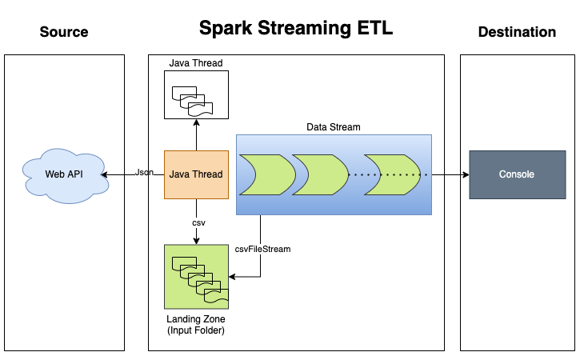

# weatherforcaststreaming
Weather forecast Realtime Streaming Application

Requirement:
	Obtain realtime weather data from the API from openweathermap.org website
	Create a realtime streaming application that ingests the input data from the source.
	Generate report as business requirement

High Level Solution:
	This application has been divided in to two parts
	1.)	RAW data ingestion as csv
	2.) Spark application to stream the data and transform as per requirement

HighLevel Design:

Checkout the Project and Build using Maven:
--mvn clean package

As part of the solution we have designed this solution to write the RAW data to local directories called "raw" and "input"(Input folder location I have used for development). But our program has been designed read from any desired location specified as program argument

Command to execute the Spark Application after build:
--spark-submit --master <yarn or "local[*]"> --deploy-mode <deploy_mode_if_yarn> /<absolute_path_to_jar>/SparkStreaming-0.0.1-SNAPSHOT.jar <config_file_absolute_path> <input_file_path_for_streaming>
 

