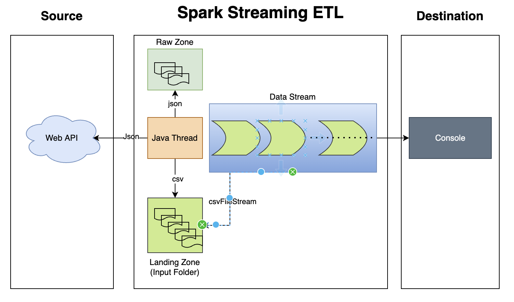

# weatherforcaststreaming
Weather forecast Realtime Streaming Application

Requirement:
============
	Obtain realtime weather data from the API from openweathermap.org website
	Create a realtime streaming application that ingests the input data from the source.
	Generate report as business requirement

High Level Solution:
====================
	This application has been divided in to two parts
	1.)	RAW data ingestion as csv
	2.) Spark application to stream the data and transform as per requirement

HighLevel Design:
=================

Solution:
===========
a.)	I have designed this solution to write the RAW data to local directories called "raw"(Json) and "input"(csv). 
b.)	A deamon thread would run in the background along with streaming application which would extract data from API and write raw and input folders. Note:- we will this input folder for spark streaming
c.) our streaming application would read data from the above input folder and write the results to console

Steps to Run the application:
=============================
1.)	Checkout the Project and Build using Maven:
	
	mvn clean package

2.)	create two directories in the current folder using following commands:

	mkdir input
	mkdir raw
	
3.) Create config file(config.prop) in current working directory with following content:
	
	locations=HongKong,Singapore,Tokyo,Seoul,London,Paris,NewYork
	app_key=86360c8475357ebb01df5334aa34a6ed
	frequency_sec=15
	aggregate_period_sec=60

4.)	Command to execute the Spark Application after build:
	
	spark-submit --master <yarn or "local[*]"> --deploy-mode <deploy_mode_if_yarn> /<absolute_path_to_jar>/SparkStreaming-0.0.1-SNAPSHOT.jar <config_file_absolute_path> <input_folder_path_created_above>

